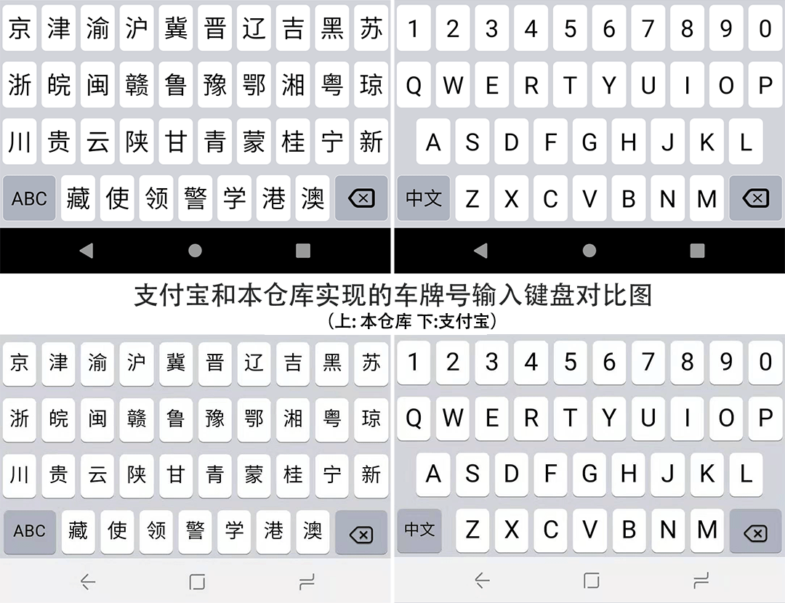
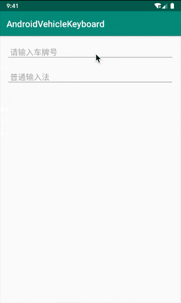

# VehicleEditText

Android用于车牌号输入的自定义键盘.仿"支付宝-车主服务-添加车辆-车牌号"输入框展示的车牌号输入键盘。

以下是本作与支付宝的对比图:


## 一、效果展示



## 二、如何使用

在`app/build.gradle`的`dependencies`节点下添加:
```groovy
implementation "wang.relish.widget:vehicleedittext:1.0.0"
```
在根目录的`build.gradle`中添加:
```groovy
allprojects {
    repositories {
        google()
        jcenter()
        maven { url "https://dl.bintray.com/relish-wang/maven/" } // 添加这行
    }
}
```
然后`Sync Now`就行啦. (aar包大小仅35kb)

### 1 使用wang.relish.widget.VehicleEditText

和正常的EditText一样使用即可。

不过需要注意VehicleEditText设置了以下监听器:
- View.OnTouchListener
- View.OnFocusChangeListener
- View.OnKeyListener

如果你也需要设置这些监听器，需要注意确保不要覆盖这些监听器的功能。而是使用VehicleEditText的setOnTouchListener2/setOnFocusChangeListener2/setOnKeyListener2等方法设置监听器。

```xml
<wang.relish.widget.VehicleEditText
    android:id="@+id/vet"
    android:layout_width="match_parent"
    android:layout_height="wrap_content" />
```

### 2 使用原生EditText
如果你不需要设置上述的监听器,你可以使用下面这种侵入性更小的方法。

```java
EditText vehicleEditText = findViewById(R.id.vet);
VehicleKeyboardHelper.bind(vehicleEditText); // 为输入框绑定车牌号输入键盘
```

## 三、混淆配置

无

